本指南旨在指导MaaYYs的使用
注意事项
    1.本软件暂时以模拟器为主,
    2.雷电模拟器适配最佳,mumu也可以使用,但是可能存在我没有发现的bug,可以加群反馈,
    3.主要以官服为主,如果你是渠道服,可以到群里找我,我会添加支持

软件主要分为两个部分,程序和资源,如果你从github下载,注意你下载的是MFWPH还是MaaYYs
MFWPH是单独的程序,MaaYYs是带资源的完整包,所以如果你只是需要自动化yys,就下载[MaaYYs](https://github.com/TanyaShue/MaaYYs/releases)里面的完整包,

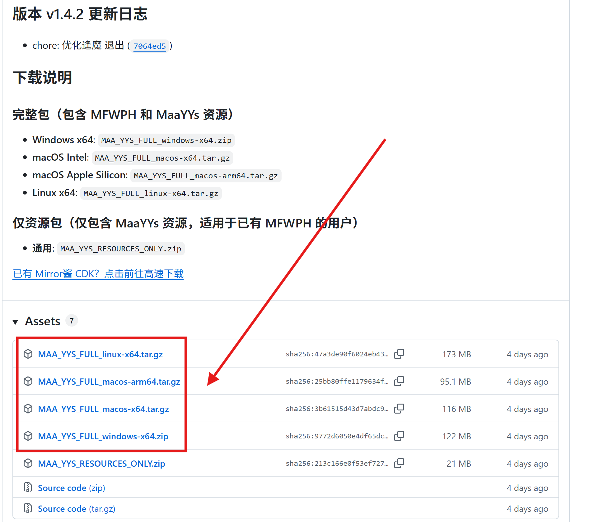

下载完成对应的系统版本的压缩包后自行解压到一个目录,运行里面的MFWPH.exe(这里是拿windows举例)
然后稍等片刻你应该能看到如下的软件界面

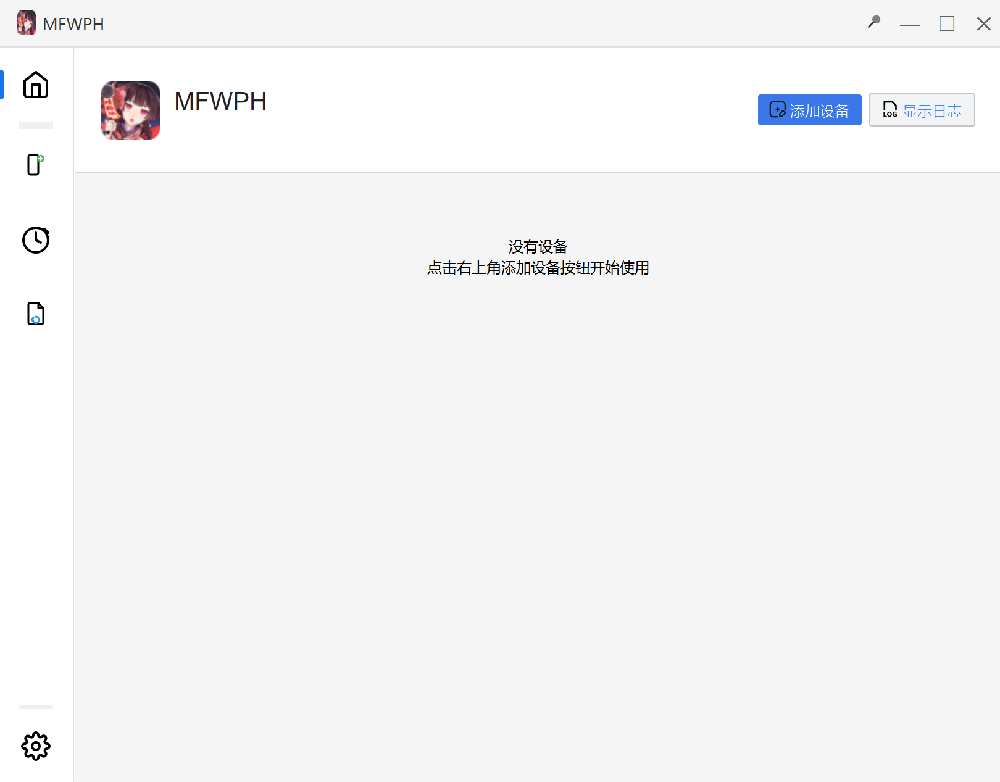

接着打开你的模拟器,确保模拟器处于运行状态,后进行下一步
添加设备,也就是模拟器,点击首页右上角的添加设备,在弹窗中搜索设备并保存
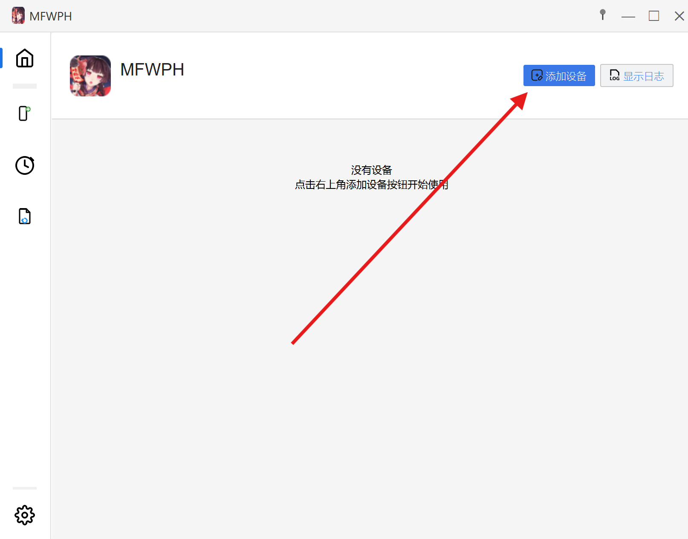
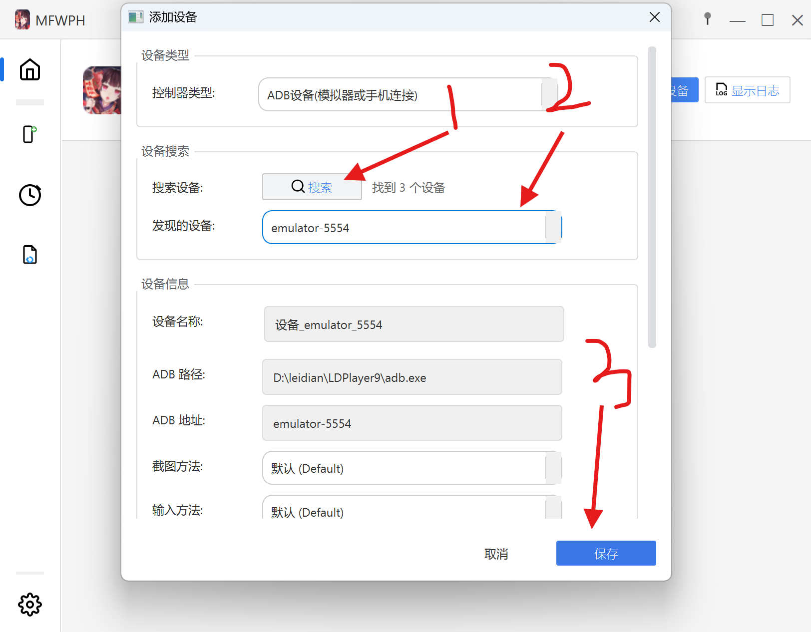

确保这里正确发现设备,没有的话需要手动添加设备,手动添加设备教程后面再说,也可点击[这里]跳转
  
接下来你应该就能看到设备卡片,首次启动前需要进行一定的设置 ,点击设备详情
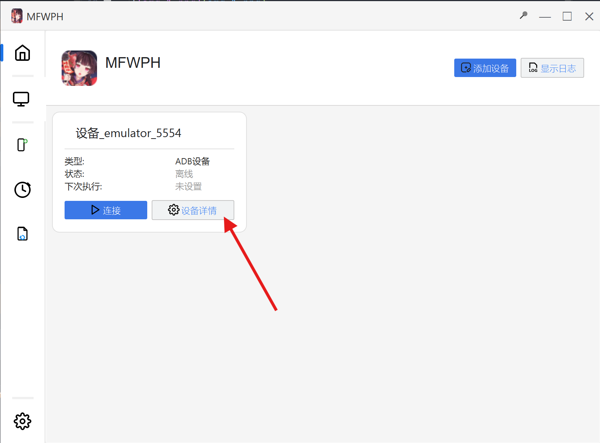
你应该能看到下面的界面
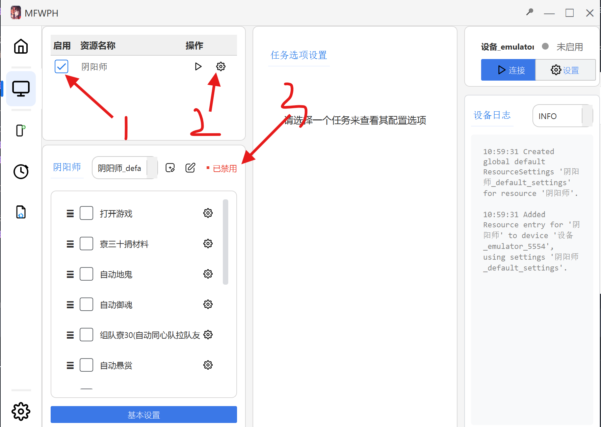
确保这里箭头3指向的位置显示以启用,显示已禁用的话就重新勾选一下箭头1指向的复选框

接着就可以开始设置你要启动的任务了,依次设置就行,

举例几个比较典型的任务的注意事项,  
1.启动任务   
启动任务这里有很多不同的区服,虽然都是官服,但是他们真实的包名是不同的,所以启动任务可能失败,我尽量列了出来
但是还是存在没有的,如渠道服,这些你们可以到群里反馈,我看到会添加进来  
2.悬赏任务或其它需要填写队伍预设的任务  
这里需要特别注意,这些分组和队伍预设名称需要尽量少使用或者不使用符号和空格(OCR模型无法正确识别)
如果遇见任务卡在这个界面可能就是识别队伍时出现异常,看看是不是队伍名称或者分组名称带了符号或者空格
可以删除后再试一次,还是不行可以到群里反馈

如我的图片中这样就没什么问题,当然这个分组可以按照你自己的喜好来写,

当所有需要设置的任务设置好之后,就可以点击右上角的连接或者启动来启动任务第一次启动时需要下载依赖,这期间不要关闭或暂停软件,这需要等待一段时间,但通常不会超过10分钟
如果超过10分钟,大概率就有问题,
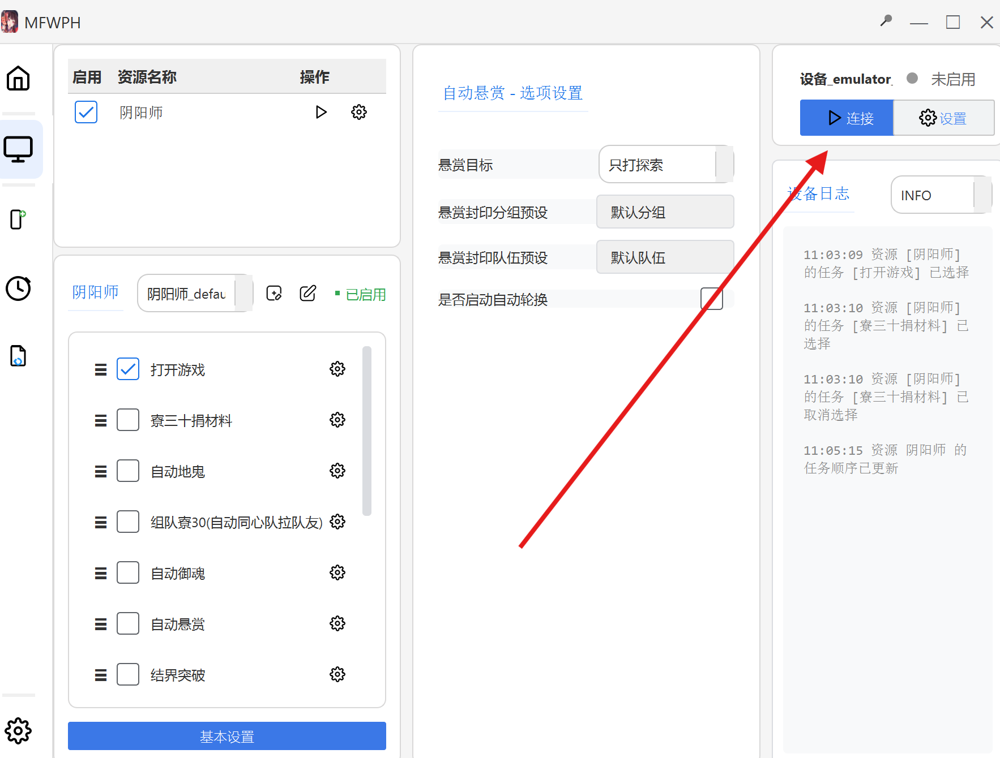
当按钮变成暂停,则表示软件正在运行,通常就没什么问题了
软件在自动化运行的过程中可能出现卡在某个节点的情况,这种情况可能是庭院的问题,庭院很多皮肤我都没有,所以没法做到完整适配 
这时你可能需要到群里反馈,我会尽可能的支持

手动添加设备.
    确定模拟器的adb端口,这一步不同的模拟器,都不相同,雷电需要在模拟器设置,其它设置中,确保adb调试开启
        mumu模拟器也是一样,随后需要确定具体端口,通常雷电从5555开始,每个模拟器加2即第二个模拟器为5557,依次类推
        mumu可以在设备诊断中查看具体的网络端口,雷电的较为复杂,稍后会讲到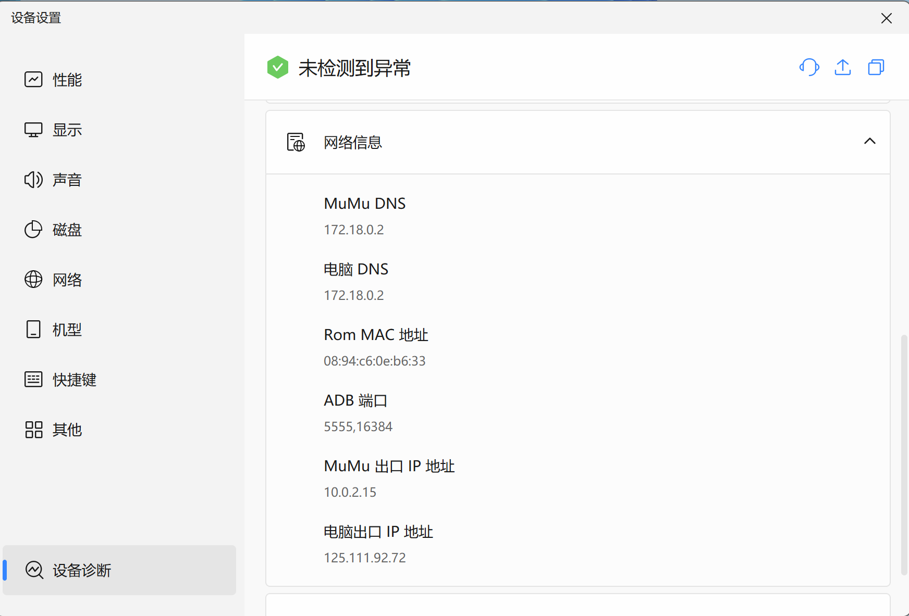
        如这样mumu存在两个端口时,只要1个就行,只写5555或者16384
    确定端口后,请记住这个端口,稍后会用到,接着就是确定adb路径,这一步各个模拟器都不同,但大致都位于模拟器的安装目录下,你可以在桌面右键模拟器,打开文件所在目录
    接着看看里面是否存在一个名为adb.exe的程序,存在的话就复制当前路径
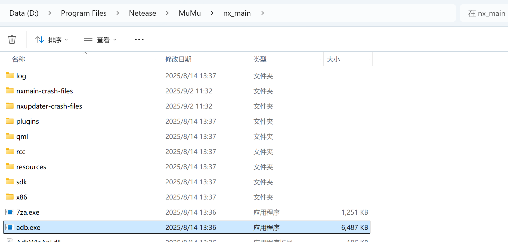
如我这个图片所示,那么它的路径就是"D:\Program Files\Netease\MuMu\nx_main\adb.exe"
将这个路径粘贴到上面添加设备的输入框中的adb路径那一栏里,adb地址就是127.0.0.1:16384(这个端口就是上面找到的端口)
对于雷电模拟器确定端口,你可以先找到adb.exe,大概率是雷电的安装目录下
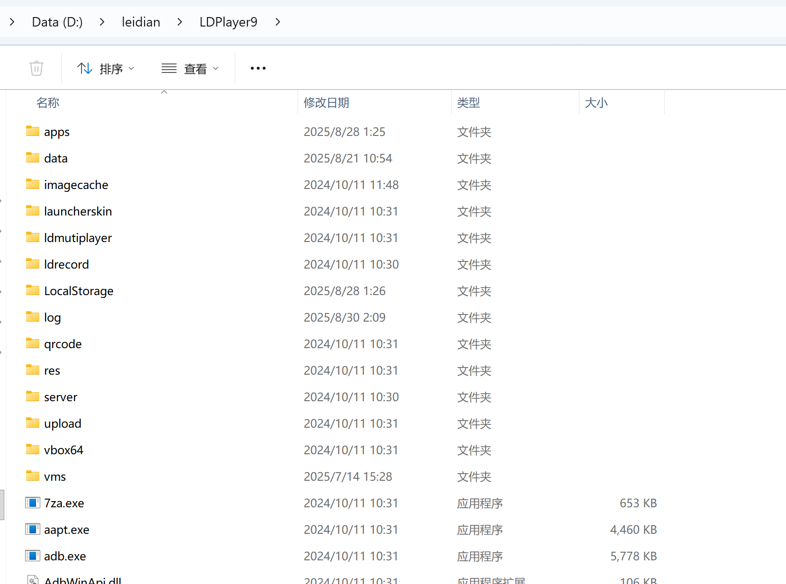
在这个目录下地址栏输入cmd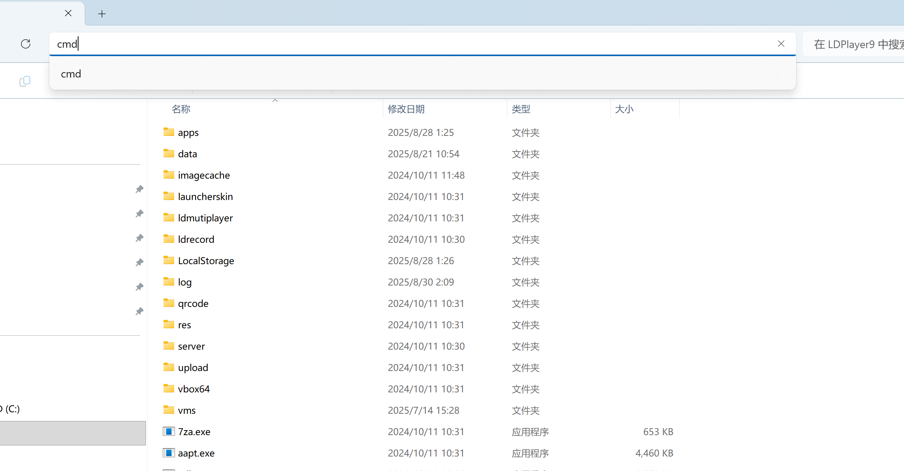
回车,会打开命令提示符窗口,输入adb.exe devices 回车就能看到端口  
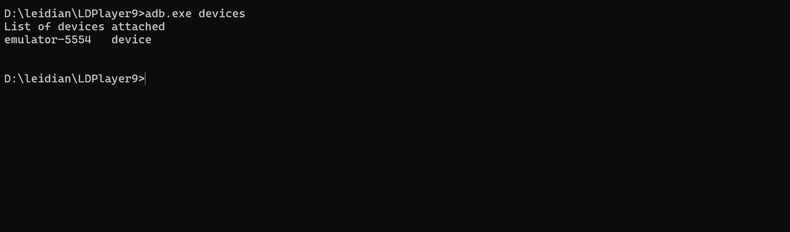
这里也有可能不显示端口直接显示设备名称,这时直接复制设备名称就行
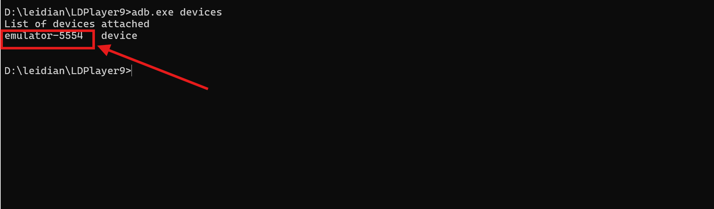
如图,那么这个设备的adb端口一栏就直接填emulator-5554而不再填写127.0.0.1:端口,直接填入emulator-5554
如果非要填写端口其实也行,那就雷电的端口通常是设备名称后面代号加一,所以图中的设备的端口其实是5555,所以你也可以直接填写127.0.0.1:5555  
填写完成大概长这样
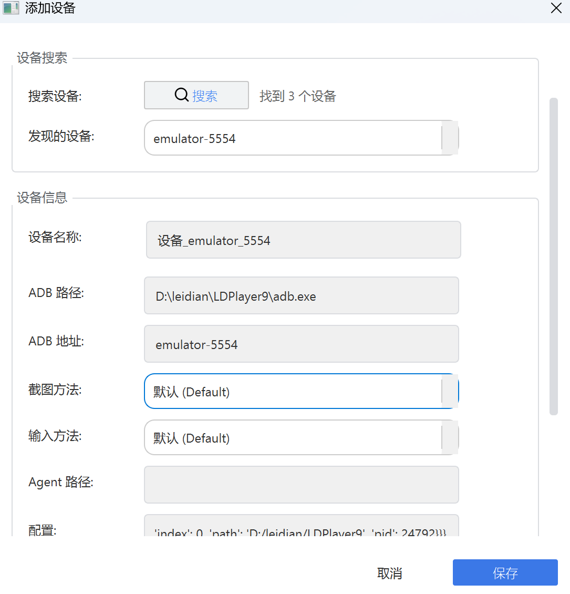
这就是手动添加设备的过程,我这里只是举例了雷电和mumu,其它模拟器同理,